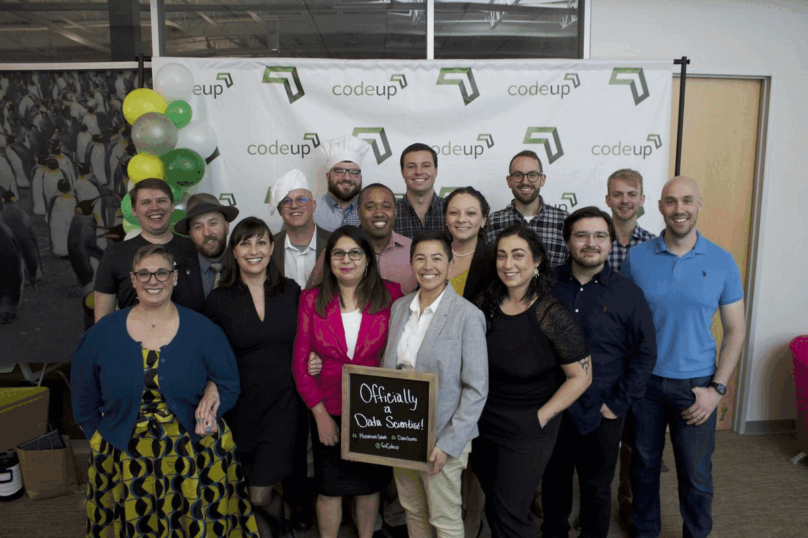

## Meet Mirzakhani

|Team Member|[IMG]|[Connect]|[STATS]|[Views]|
|:----------|:---:|:--------:|:----:|:-----:|
|Burton Barnes||||
|Yuvia Cardenas||||
|Rae Downen||||
|Justin Evans||||
|Mark Foster||||
|Yvette Ibarra||||
|Cristina Lucin||||
|Michael Mesa||||
|Nadia Paz||||
|Chris Rosenberger||||
|Woody Sims||||
|Allante Staten||||
|Zachary Stuffenbeme|.jpeg)|||
|Naomi Sweat||||
